# VerisZone — Milestones & Gantt

> Living plan. Updated every cycle. The timeline axis is **cycles** (one
> build→test→review→merge loop), **not calendar dates** — the owner sets cadence.
> Statuses match `docs/SPEC.md`. "Here?" = can it be completed & verified in this
> sandbox: ✅ yes · ⚠️ partial (logic yes, live proof needs real env) · ❌ no.

## Milestone status

| ID | Milestone | Status | Here? | Depends on | Cycles (est.) |
|----|-----------|--------|-------|-----------|---------------|
| **M0** | Foundation & spine (object model, lifecycle, role lenses, computed posture, 32/32 frameworks) | ✅ DONE | ✅ | — | done |
| **M1** | Governance workflows (breach · AIA/DPIA/FRIA · data provenance · carbon disclosure) | ✅ DONE | ✅ | M0 | done |
| **M-TEST** | Click-integrity harness — walk every role × surface, test clickability, capture **location + console logs + errors**, emit a report (the D10 gate) | ✅ DONE | ✅ | M0 | done |
| **M-UAE** | UAE / Dubai regulatory pack — PDPL · DIFC · ADGM · DESC + data-residency/cloud, computed posture | ✅ DONE | ✅ | M0 | done |
| **M-AR** | Arabic + RTL — i18n scaffolding + 1 pilot surface **done**; estate-wide rollout remains | ◐ PILOT DONE | ✅ | M0 | rollout remains |
| **M-ENF** | Veris Enforce product-line — shared core + data contract + per-tenant entitlement gate + locked/live surface states | ⬜ TODO | ⚠️ | M0 (live enf. → M6) | 2 |
| **M2** | Data-subject-rights lifecycle (consent capture/withdraw · DSAR access/correction · retention/erasure) | ⬜ TODO | ✅ | M0 | 1–2 |
| **M-UX** | Readability & type lock — enforce SPEC §E across every surface | ⬜ TODO | ✅ | M0 | 2–3 |
| **M3** | Governance depth — retire remaining honest Partials via real controls (not relabels) | ◐ ONGOING | ✅ | M0 | rolling |
| **M4** | Real backend live — Auth.js + Postgres + tenant isolation + server RBAC in a real env | ⬛ BLOCKED | ⚠️ | owner infra | 1 + owner |
| **M5** | Gateway live — model keys + real routing + policy enforcement on live inference | ⬛ BLOCKED | ⚠️ | M4, keys | 2 + owner |
| **M6** | Enforcement live — egress proxy/agent + capability broker + shadow-AI extension in a real network | ⬛ BLOCKED | ❌ | M5, customer integration | ext. + integration |
| **M7** | Self-host packaging — Docker/compose, config, install docs, air-gap mode (D2) | ⬜ TODO | ✅ | M4 | 2 |
| **M8** | Hardening & assurance — security review, pen-test, load test, external audit prep | ⬜ TODO | ❌ | M4–M7 | external |

Legend: ✅ done · ◐ ongoing · ⬜ ready to start · ⬛ blocked (owner/integration) · ⚠️ logic-here-only · ❌ needs real environment.

## Critical path
`M0 → M1 → [M2 · M-UX · M3 buildable now] → M4 (owner) → M5 (owner) → M6 (integration) → M8`.
M7 can run in parallel once M4 lands. **The enforcement promise (D1) is gated on
M4→M5→M6; the last of those (M6/M8) genuinely cannot be finished in this sandbox.**

## Gantt (axis = cycles, not dates)

```mermaid
gantt
    title VerisZone — cycle-based plan (axis = build cycles, not calendar)
    dateFormat  X
    axisFormat  c%L
    section Built
    M0 Foundation & spine        :done, m0, 0, 3
    M1 Governance workflows      :done, m1, 3, 4
    section Buildable now (this sandbox)
    M2 Data-subject rights       :active, m2, 7, 2
    M-UX Readability lock        :m_ux, 9, 3
    M3 Governance depth (rolling):m3, 7, 6
    section Owner / infra gated
    M4 Real backend live         :crit, m4, 12, 2
    M5 Gateway live              :crit, m5, 14, 2
    M7 Self-host packaging       :m7, 14, 2
    section Cannot finish here
    M6 Enforcement live          :crit, m6, 16, 4
    M8 Hardening & assurance     :m8, 20, 4
```

## This cycle (C1)
- **Done:** Charter/Spec/Gantt + `docs/ROADMAP.md`; locked D7 (Veris Enforce product-line), D8 (Arabic pilot-first), D9 (UAE/Dubai), D10 (test gate).
- **Owner priorities (this message):** M-TEST → M-UAE → M-AR (in that order), Arabic pilot-first.
- **Building next:** **M-TEST** — the click-integrity harness, first, so every later cycle is gated by it.
- **Owner action outstanding (unblocks M4):** provision `AUTH_SECRET`, `DATABASE_URL`, `DIRECT_URL`; run `npm run db:push`.

- **C9** — M-AR **content cycle 2b** (UAE/Dubai compliance set): **Framework Library — UAE PDPL mapping** in Arabic (`compliance.jsx` `PageFrameworkLibrary` + bilingual `uae-mappings.js`). Owner chose the **UAE-focused slice**: the library chrome (title, sub, jurisdiction label, 4 KPIs, mapping-detail panel headers, instruments block, table headers, status labels, mapping toggle, "Best for", Veris Intelligence, Apply button) renders Arabic, and the **UAE PDPL mapping** — 6 instruments (PDPL/DIFC/ADGM/DESC/IA/ethics) + 14 obligations with control/surface/computed status — renders fully in Arabic from its data. Acronyms & legal citations kept in original form. The 33 framework **cards' data** (name/focus/best-for) stay English by design (fallback); the parent Posture/Frameworks tab bar + `FW_CATEGORIES` headers also remain English (out of this slice — a later cycle). Build ✓; live AR verify via AI Central → Compliance & Standards → Frameworks → UAE chip: RTL active, all Arabic present, 0 console errors.
- **C8** — M-AR **content cycle 2a** (UAE/Dubai compliance set): **Jurisdiction Atlas** surface fully Arabic (`guidebook.jsx` + bilingual regime data in `jurisdictions.js`) — title, 4 KPIs, the full 16-regime register (regime, jurisdiction, instrument, status, effective date, penalty, note) all carry Arabic variants, the status pills, filter chips, table headers, region list, export toast and Veris Intelligence note. The **UAE / Dubai** row renders in Arabic (بيانات وذكاء الإمارات / دبي) with PDPL/DIFC/ADGM/DESC/GPAI acronyms kept in original form for verifiable citation; page title aligned to the existing nav term (أطلس الولايات القضائية). Build ✓; live AR verify — RTL active, all Arabic strings present, 0 leftover targeted English, 0 console errors. **Also fixed the click-integrity flow: the first-run guided-tour modal must be dismissed (Skip tour) before role/nav/lang clicks register.** Next: the framework-library / compliance-mapping UAE surfaces.
- **C7** — M-AR **content cycle 1c**: **Data Provenance** surface fully Arabic (`data-provenance.jsx`) — title/KPIs, provenance register (headers, statuses, PII levels, lawful bases, units, systems), the 8 provenance dimensions, source list, six-stage workflow (Catalogue/Classify/Clear/Validate/Record/Review), owners, Veris Intelligence note, buttons — via `registerContent`/`ts()`. Legal citations kept in original form; aria-labels stay English. Build ✓; live AR verify 0 console errors. **Governance-workflow triad now Arabic: Breach ✅ · Impact Assessments ✅ · Data Provenance ✅.** Next content set: UAE/Dubai compliance surfaces.
- **C6b** — M-AR **content cycle 1b**: **Impact Assessments** surface (AIA/DPIA/FRIA) fully Arabic (`convergence.jsx` → `AIAssessment`) via `registerContent`/`ts()`. Bilingual **glossary** shipped alongside (`glossary.js` + `guidebook.jsx`) — every term carries `termAr`/`defAr`, plus this session's new terms. Build ✓; live AR verify 0 console errors.
- **C6** — M-AR **content cycle 1a**: **Breach Notification** surface fully Arabic (headings, KPIs, regime table, register, computed clocks, five-stage workflow, Veris Intelligence, buttons — legal citations kept in original form). Added `LangContext`/`useLang` + `ts()`/`registerContent` content-translation mechanism. Gate (CGO): 36 surfaces, 0 failures; live AR verify 0 console errors. **1 of ~152 surfaces content-localised** — surface-by-surface continues.
- **C5** — M-AR **shell done**: shell-level Arabic + RTL — global EN/ع header toggle (persisted), the whole app wrapper flips `dir="rtl"`, the **sidebar moves to the right**, and all ~90 nav labels + section headers + chrome translate (aria-labels stay English so tests hold). Added `UI_LANG=ar` mode to the click-integrity harness. **AR/RTL full-estate gate: 153 surfaces, 0 blank, 0 hard failures.** Surface **content** localisation is next — owner chose proper surface-by-surface (all four priority sets), a multi-cycle program.
- **C4** — M-AR **pilot done**: i18n scaffolding (`lib/i18n.js`) + an Arabic/RTL Governance Briefing pilot surface (`arabic-pilot.jsx`) under CGO, with an on-surface EN/العربية toggle.
- **C3** — M-UAE **done**: UAE/Dubai pack (`lib/uae-mappings.js`) — 6 instruments, 14 obligations, computed posture 77. Registered in the framework library (now 33/33 Operational), the compliance panel + jurisdiction chip (🇦🇪), and the Jurisdiction Atlas. Gate re-run (CGO/CEO/Legal): 56 surfaces, 0 failures.
- **C2** — M-TEST **done**: click-integrity harness (`scripts/click-integrity.mjs`) + report. Full 13-role walk: 152 surfaces, 0 blank, 0 hard failures. Added `data-testid="vz-main"` so the content pane is measurable.
- **C1** — Added M-TEST, M-UAE, M-AR, M-ENF; locked Veris Enforce product-line, Arabic, UAE/Dubai, test-gate decisions; added ROADMAP.
- **C0** — Charter/Spec/Gantt created; ambition = full enforcement platform; deployment = SaaS→self-host.
