# VerisZone — Milestones & Gantt

> Living plan. Updated every cycle. The timeline axis is **cycles** (one
> build→test→review→merge loop), **not calendar dates** — the owner sets cadence.
> Statuses match `docs/SPEC.md`. "Here?" = can it be completed & verified in this
> sandbox: ✅ yes · ⚠️ partial (logic yes, live proof needs real env) · ❌ no.

## Milestone status

| ID | Milestone | Status | Here? | Depends on | Cycles (est.) |
|----|-----------|--------|-------|-----------|---------------|
| **M0** | Foundation & spine (object model, lifecycle, role lenses, computed posture, 32/32 frameworks) | ✅ DONE | ✅ | — | done |
| **M1** | Governance workflows (breach · AIA/DPIA/FRIA · data provenance · carbon disclosure) | ✅ DONE | ✅ | M0 | done |
| **M2** | Data-subject-rights lifecycle (consent capture/withdraw · DSAR access/correction · retention/erasure) | ⬜ TODO | ✅ | M0 | 1–2 |
| **M-UX** | Readability & type lock — enforce SPEC §E across every surface | ⬜ TODO | ✅ | M0 | 2–3 |
| **M3** | Governance depth — retire remaining honest Partials via real controls (not relabels) | ◐ ONGOING | ✅ | M0 | rolling |
| **M4** | Real backend live — Auth.js + Postgres + tenant isolation + server RBAC in a real env | ⬛ BLOCKED | ⚠️ | owner infra | 1 + owner |
| **M5** | Gateway live — model keys + real routing + policy enforcement on live inference | ⬛ BLOCKED | ⚠️ | M4, keys | 2 + owner |
| **M6** | Enforcement live — egress proxy/agent + capability broker + shadow-AI extension in a real network | ⬛ BLOCKED | ❌ | M5, customer integration | ext. + integration |
| **M7** | Self-host packaging — Docker/compose, config, install docs, air-gap mode (D2) | ⬜ TODO | ✅ | M4 | 2 |
| **M8** | Hardening & assurance — security review, pen-test, load test, external audit prep | ⬜ TODO | ❌ | M4–M7 | external |

Legend: ✅ done · ◐ ongoing · ⬜ ready to start · ⬛ blocked (owner/integration) · ⚠️ logic-here-only · ❌ needs real environment.

## Critical path
`M0 → M1 → [M2 · M-UX · M3 buildable now] → M4 (owner) → M5 (owner) → M6 (integration) → M8`.
M7 can run in parallel once M4 lands. **The enforcement promise (D1) is gated on
M4→M5→M6; the last of those (M6/M8) genuinely cannot be finished in this sandbox.**

## Gantt (axis = cycles, not dates)

```mermaid
gantt
    title VerisZone — cycle-based plan (axis = build cycles, not calendar)
    dateFormat  X
    axisFormat  c%L
    section Built
    M0 Foundation & spine        :done, m0, 0, 3
    M1 Governance workflows      :done, m1, 3, 4
    section Buildable now (this sandbox)
    M2 Data-subject rights       :active, m2, 7, 2
    M-UX Readability lock        :m_ux, 9, 3
    M3 Governance depth (rolling):m3, 7, 6
    section Owner / infra gated
    M4 Real backend live         :crit, m4, 12, 2
    M5 Gateway live              :crit, m5, 14, 2
    M7 Self-host packaging       :m7, 14, 2
    section Cannot finish here
    M6 Enforcement live          :crit, m6, 16, 4
    M8 Hardening & assurance     :m8, 20, 4
```

## This cycle (C0)
- **Done:** Charter + Spec + Gantt established and locked with the owner.
- **Decisions locked:** D1 full enforcement · D2 SaaS→self-host.
- **Next candidate (owner to confirm):** **M2 — Data-subject-rights lifecycle** (fully buildable & testable here), or **M-UX — Readability lock** if type/readability is the priority.
- **Owner action outstanding (unblocks M4):** provision `AUTH_SECRET`, `DATABASE_URL`, `DIRECT_URL`; run `npm run db:push`.

## Changelog
- **C0** — Charter/Spec/Gantt created; ambition = full enforcement platform; deployment = SaaS→self-host.
